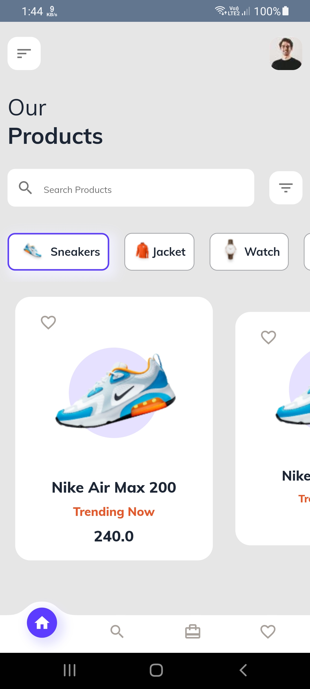
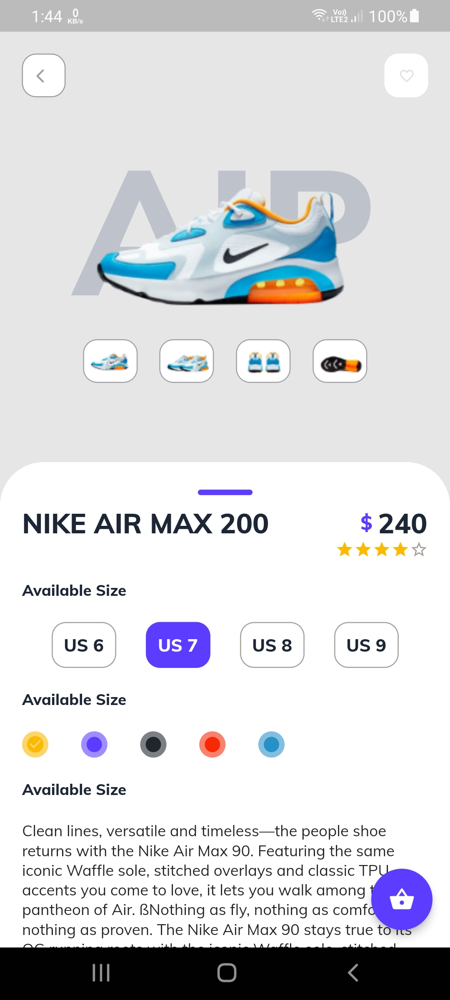
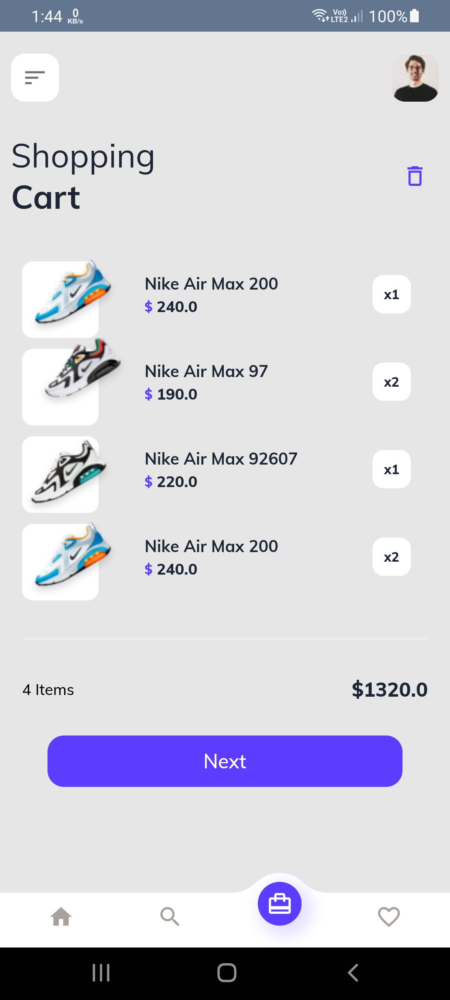

# E-commerce_app_ui 🛒

E-Commerce app is a design implementaion of [E-commerce App UI](https://dribbble.com/shots/10446127-E-commerce-App-Exploration/attachments/2283107?mode=media) designed by [Imran](https://dribbble.com/Saif_Uddin_Imran)

<div align="center">

[](#)
[](https://github.com/a7madZ3Dev/E-commerce_app_ui/fork)
[](https://github.com/a7madZ3Dev/E-commerce_app_ui/issues)
[](#)

</div>


## 📱 Screen Shots 

    

## 🎥 Promo Video

    


## Directory Structure

```
lib
│───main.dart    
└───src
    │───config
    |    └──route.dart
    │───model
    │    │──category.dart
    |    │──data.dart
    |    └──product.dart
    │───pages
    |    │──home_page.dart
    |    │──main_page.dart
    |    │──product_detail.dart
    |    └──shopping_cart_page.dart
    │───theme
    |    │──light_color.dart
    |    └──theme.dart
    └───widgets
         │──bottom_n_avigation_bar
         |   |──bottom_curved_painter.dart
         |   |──bottom_navigation_bar.dart
         |   └──centered_elastic_in_curve.dart
         |──custom_route.dart
         |──extensions.dart
         |──product_card.dart
         │──product_icon.dart
         └──title_text.dart
```

## 🧑 Author

#### Ahmad Alzoabi
[](https://www.linkedin.com/in/ahmad-al-zoabi-0623a8233/)

You can also follow my GitHub Profile to stay updated about my latest projects:

[](https://github.com/a7madZ3Dev)

If you liked the repo then kindly support it by giving it a star ⭐!

Copyright (c) 2023 Ahmad Alzoabi

## Visitors Count


